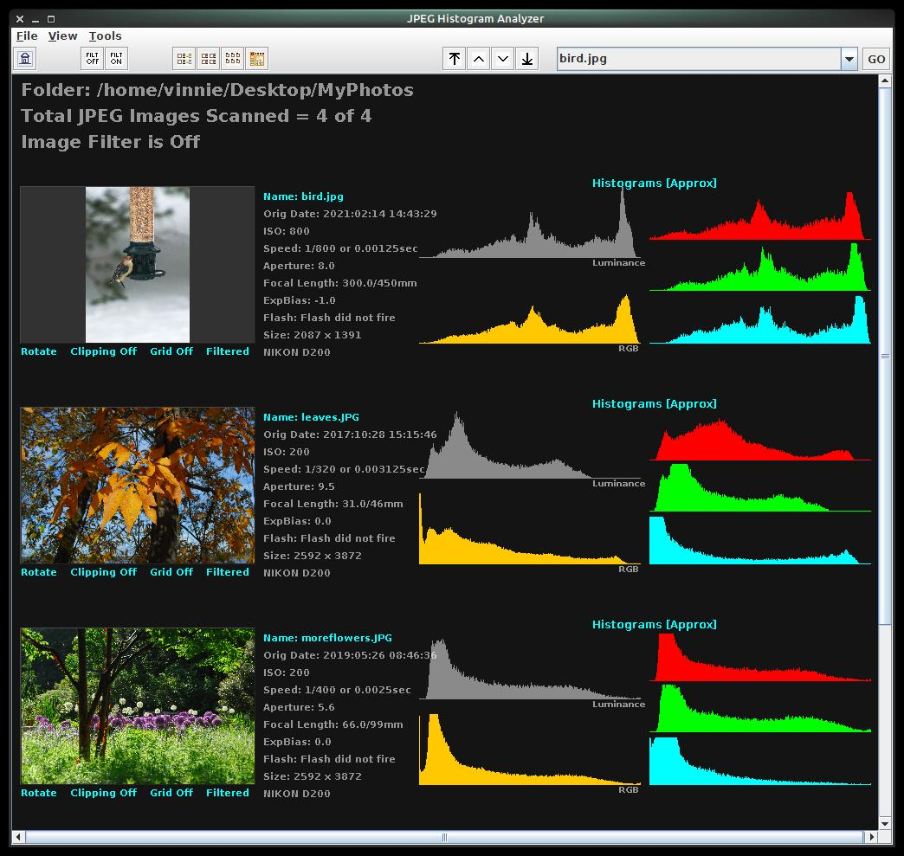
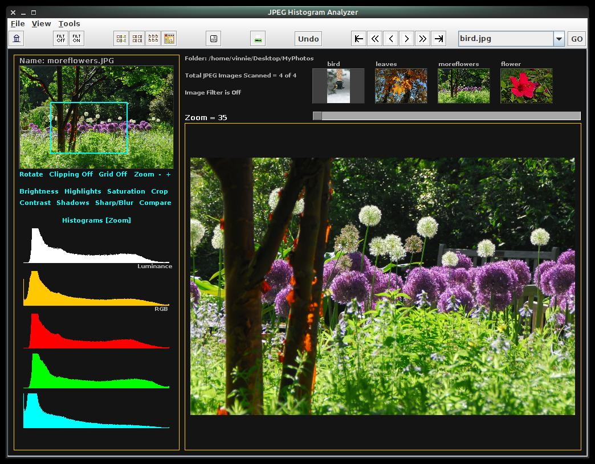

# JPEG-Histogram-Tool
Java desktop application to view and study histograms of JPEG images

To compile the application run "javac HistogramTool.java"
To run the application run "java HistogramTool" 

The application provides two ways to view and study image histograms:

The list view provides the following features:
  * Display images, basic camera settings, and histograms for multiple images at once
  * Enlarge image to fill application window by simply clicking anywhere on the image.  Click again 
    to zoom in to 100%, and click once more to return to the list view.
  * Rotate image
  * Identify shadow and highlight clipping.  Shadow clipping will appear bright blue 
    and highlight clipping will appear bright red.
  * Rename images
  * Filter list of images to easily focus on subsets of images

The detail view provides the following features:
  * Zoom in to parts of image and display histogram for only that specific area
  * Select section of histogram to show only those image pixels.
  * Edit images by adjusting brightness, highlights, shadows, saturation, contrast, 
    sharpness to see impact on histogram.
  * Crop image
  * Save image changes
  * Print image

